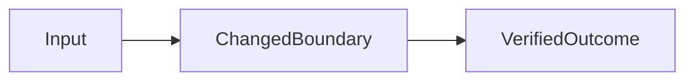

# _Outcome delivered_

> Thesis: _In one sentence, connect the user problem, delivered slice, and evidence._

## Problem and proof

- **User/operator:**
- **End-to-end outcome:**
- **Success criteria:**
- **Intentionally out of scope:**

## Live path

1. _Starting state or input._
2. _Action and visible system behavior._
3. _Completed outcome._

**Fallback:** _Deterministic command, fixture, output, or screenshot._

## System path

## Key decision

| Option | Value | Cost/risk | Evidence | Decision |
|---|---|---|---|---|
| Chosen |  |  |  | PASS |
| Rejected |  |  |  | REJECTED |

## Verification

| Claim | Before | After | Failure/edge case | Status | Evidence |
|---|---|---|---|---|---|
| User-visible behavior |  |  |  | UNVERIFIED |  |
| Core logic |  |  |  | UNVERIFIED |  |
| Cross-repo contract |  |  |  | UNVERIFIED |  |
| Regression safety |  |  |  | UNVERIFIED |  |

## Failure in public

- **Consequential failure:**
- **Current behavior:**
- **Mitigation or safe fallback:**
- **Remaining gap:**

## What changed my mind

- _Evidence or teammate feedback that altered the implementation._

## Honest stopping point

- **Verified:**
- **Partial:**
- **Failed or unverified:**
- **Why this is the rational stopping point:**

## Next hour, day, and week

| Horizon | Highest-impact improvement | Why now | Proof I would require |
|---|---|---|---|
| One hour |  |  |  |
| One day |  |  |  |
| One week |  |  |  |

## Likely questions

- **Why this scope?**
- **How do you know it works?**
- **What is most likely to fail?**
- **What would you do differently?**
