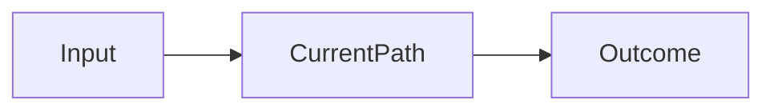

# Project notebook

Last updated:
Demo time:
Usable work began:
Current state: green | yellow | red

## Problem contract

- **Trigger and inputs:**
- **End-to-end outcome:**
- **Required rules or steps:**
- **Constraints and authority boundaries:**
- **Exception or human-review path:**
- **Observable proof of completion:**
- **Non-goals:**
- **Open questions:**

### Acceptance examples

| Case | Input/condition | Expected behavior | Why it matters |
|---|---|---|---|
| Representative |  |  |  |
| Boundary |  |  |  |
| Failure/review |  |  |  |

## Collaboration contract

- Preferred checkpoint cadence:
- Engineer/domain feedback that changed the plan:
- Next decision-changing question:

## Workspace map

| Repo | Purpose | Entry point | Build/test command | Planned touch | Owner |
|---|---|---|---|---|---|
|  |  |  |  |  |  |

### Interface ledger

| Producer | Contract | Consumer | Current evidence | Proposed change | Integration order |
|---|---|---|---|---|---|
|  |  |  |  |  |  |

### Smallest relevant path

## Current bet

- **Chosen slice:**
- **Expected value:**
- **Riskiest assumption:**
- **Validation target:**
- **Stopping rule:**
- **Rejected alternative:**

## Evidence ledger

| Claim | Evidence | Confidence | What would disconfirm it? |
|---|---|---|---|
|  |  |  |  |

## Decisions

### Decision: _short name_

- **Context:**
- **Options:**
- **Choice and evidence:**
- **Tradeoff and reversibility:**
- **Review trigger:**

## Experiment and critique log

### Experiment: _short name_

- **Intent and success condition:**
- **Method:**
- **Observed result:**
- **Strongest counterevidence or failure:**
- **Learning and next action:**

## Parking lot

- Deliberately deferred:
